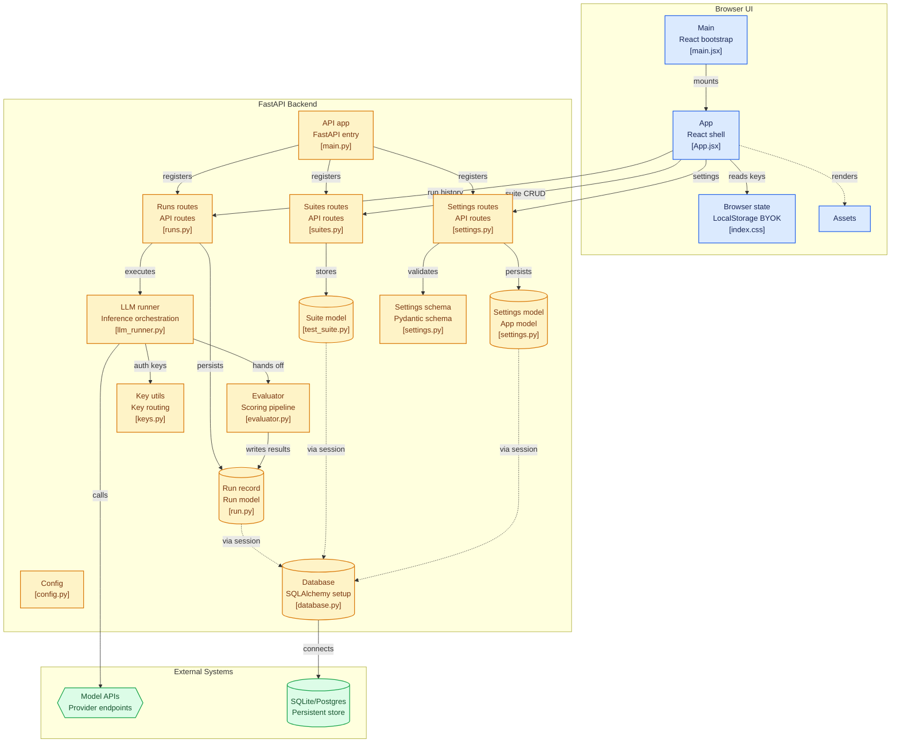

# ARBITER

**Live Deployment:** [https://arbiter-umber.vercel.app/](https://arbiter-umber.vercel.app/)

**LLM Eval Platform** — A professional, high-performance web platform for massively parallel LLM evaluation and telemetry analysis. Arbiter allows engineers and prompt designers to rapidly test prompt configurations against expected outputs across an array of frontier AI models simultaneously.

## Key Features

- **Multi-Model Concurrency**: Fire multiple LLM completions at once (Gemini, Groq/LLaMA, OpenAI, Anthropic, Deepseek, Mistral, OpenRouter).
- **BYOK (Bring Your Own Key) Security**: Keys are securely stored locally in the browser's `localStorage` and sent over HTTPS only when running an evaluation. They are never written to any server database. Server fallbacks are also supported.
- **Three-Tier Evaluation Engine**:
  - **Deterministic Checks**: JSON compliance, strict string matching, length validation, RegEx rules.
  - **Semantic Similarity**: Vector-based semantic scoring using `all-MiniLM-L6-v2` via `sentence-transformers`.
  - **LLM-as-a-Judge**: Designate any available model to analytically score and reason over the raw outputs.
- **Dynamic Judge Selector**: Swap your judging model from the UI via a compact drop-up menu.
- **Raw Inference Logging**: Inspect exactly what each model rendered per test case.
- **Suite Management**: Create, edit, and delete test suites with full CRUD backed by SQLite (local) or PostgreSQL (production).
- **Run History**: Browse, compare, and revisit past evaluation runs.

## Platform Walkthrough

A visual tour of the Arbiter evaluation platform in action.

### 1. Dashboard Overview

*The centralized hub for tracking your LLM evaluation suites and viewing macro score correlations.*

### 2. Creating a Test Suite


*Defining precise deterministic evaluation controls (RegEx, length, strict match) for test cases.*

### 3. LLM-as-a-Judge Analysis


*Leveraging strong reasoning models (like GPT-4o or Llama 3.3 70B) to score and critically evaluate the raw outputs of other models.*

### 4. Raw Inference Tracing

*Inspecting the raw outputs to diagnose why specific models passed or failed semantic similarity thresholds.*

## Stack

| Layer | Technology |
|---|---|
| Frontend | React + Vite, vanilla CSS, Framer Motion, Recharts |
| Backend | FastAPI, Pydantic, SQLAlchemy ORM |
| Database | SQLite (Local) / PostgreSQL (Production) |
| Architecture| Vercel (Frontend Hosting) + Railway (Backend/DB) |
| Orchestration | Docker Compose (Local Development) |

## Security & BYOK Architecture

Arbiter is designed with a **Bring Your Own Key** architecture. 
1. Users enter their provider API keys directly into the browser settings UI.
2. Keys are saved in `localStorage`.
3. When an evaluation is triggered, the keys are injected into the HTTP request headers.
4. The backend consumes the headers to authenticate with the providers.
5. **Zero server storage:** API keys are never written to disk or the database.

*Note: For public deployments, the server can still be configured with fallback API keys in `.env` for users who do not provide their own.*

## System Architecture Diagram



## Quickstart (Local Docker)

1. Launch the platform:
```bash
docker-compose up --build -d
```

2. Open `http://localhost/` (Nginx) or `http://localhost:5173/` (Vite dev).
3. Open the **Settings** page in the UI to add your API keys.

## Deployment Architecture

Arbiter is designed to be easily deployed to modern serverless and containerized cloud providers.

### Frontend (Vercel)
1. Push the repository to GitHub.
2. Import the `frontend` directory into Vercel as a Vite project.
3. Set the `VITE_API_URL` environment variable to your backend domain (e.g., `https://arbiter-backend.up.railway.app`).

### Backend (Railway)
1. Connect your GitHub repository to Railway.
2. Railway will automatically detect the `railway.json` configuration in the `backend` directory.
3. Provision a PostgreSQL database in Railway and link it to the backend service.
4. The backend will automatically create all necessary tables upon startup.

## Injecting Custom Models

Arbiter natively populates its UI with the best default models for every API key you provide. However, you can inject highly specific, newly-released, or fine-tuned models for server fallback.

Simply add them as a comma-separated list to the `CUSTOM_MODELS` variable in your `backend/.env` file:
```env
CUSTOM_MODELS="mistral/open-mistral-nemo,groq/llama-guard-3-8b,deepseek/deepseek-coder"
```
*Note: Ensure you prefix the model name with the provider (e.g., `mistral/`, `groq/`, `deepseek/`, `google/`, `anthropic/`, `github/`) so the backend knows which API key to route it through.*

## Local Development

**Backend:**
```bash
cd backend
python -m venv venv
venv\Scripts\activate
pip install -r requirements.txt
uvicorn app.main:app --reload
```

**Frontend:**
```bash
cd frontend
npm install
npx vite
```

## API Endpoints

| Method | Endpoint | Description |
|---|---|---|
| `GET` | `/api/models` | Returns available models based on configured API keys |
| `POST` | `/api/runs/evaluate` | Run evaluation: `{ suiteId, models[], judgeId }` |
| `GET` | `/api/runs` | List past evaluation runs |
| `POST` | `/api/suites` | Create a new test suite |
| `PUT` | `/api/suites/:id` | Update an existing suite |
| `DELETE` | `/api/suites/:id` | Delete a suite |
